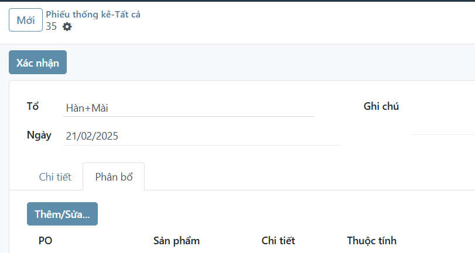
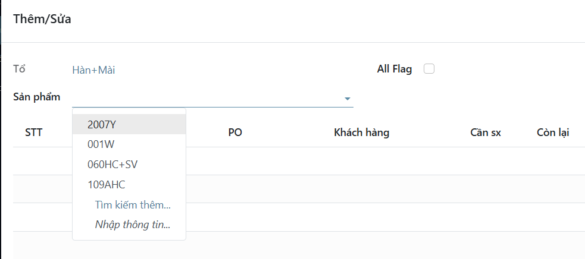
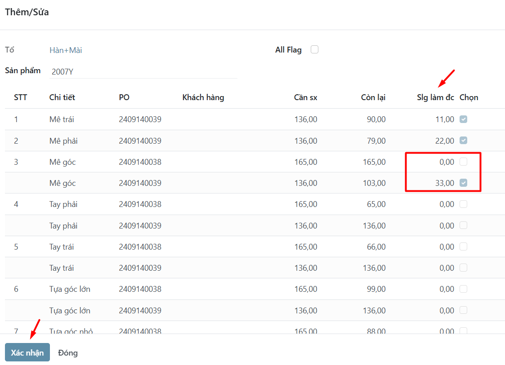

# Phiếu thống kê (Người quản lý)
*Menu:* Sản xuất -> Nhập liệu -> Phiếu thống kê\Tất cả

## Điều chỉnh số dư ban đầu
Tương tự như tạo phiếu mới với số lượng là số đã làm đc (luỹ kế) của từng chi tiết/công đoạn.

Tham khảo thao tác [Tạo phiếu mới](labor-hed.md)

## Phân bổ lại số lượng

### Quy tắc phân bổ tự động:
- Đơn nào xác nhận trước phân bổ trước
- Chỉ phân bổ vào những đơn có trạng thái `Xác nhận` (ẩn những đơn `Nháp` hoặc `Hoàn thành`)

### Trường hợp muốn sửa lại:

1. Mở phiếu muốn điều chỉnh
2. Chọn tab `Phân bổ`
3. Nhấn nút `Thêm/Sửa`
    

    Hiện ra hộp thoại
    
    3.1 Chọn sản phẩm
    

    3.2 Điền/sửa lại số lượng làm đc theo PO
    

    3.3 Nhấn nút `Xác nhận` hộp thoại