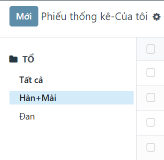
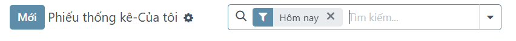
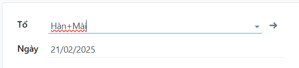
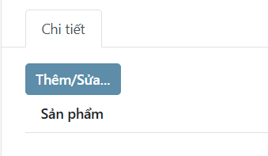
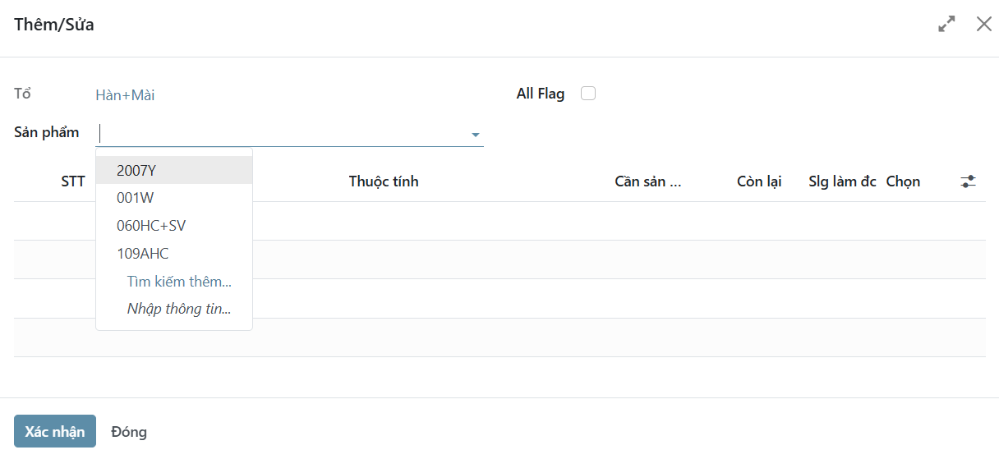
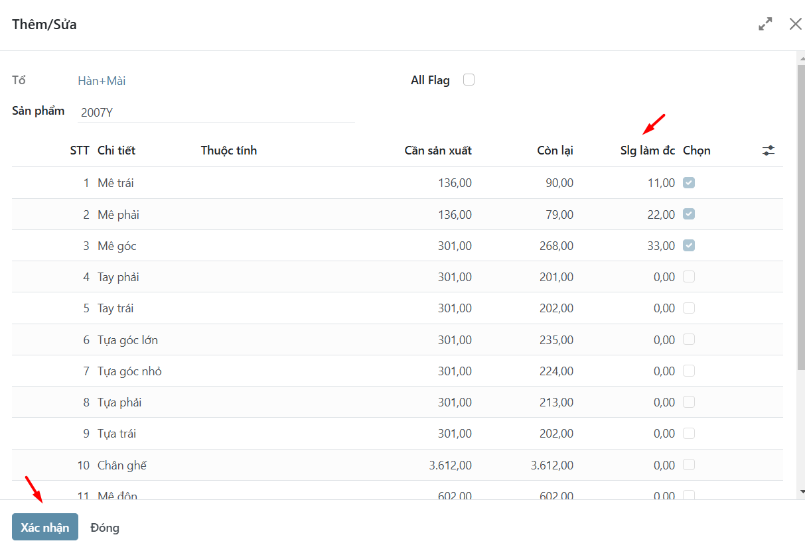
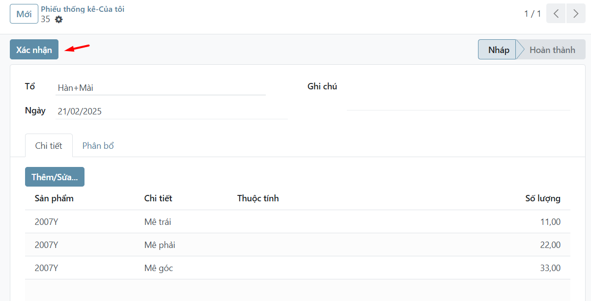

# Phiếu thống kê
*Menu:* Sản xuất -> Nhập liệu -> Phiếu thống kê\Của tôi

## Tìm kiếm phiếu
1. Lọc theo `Tổ`
    
2. Bỏ lọc `Hôm nay`
    Mặc định chỉ hiện các phiếu được nhập hôm nay.

    Để hiện tất cả phiếu, nhấn nút bỏ lọc `Hôm nay`
    

## Tạo phiếu mới
1. Nhấn nút `Mới`
2. Chọn **Tổ** (bắt buộc) và sửa lại **Ngày** (nếu cần)
    
3. Nhấn nút `Thêm/Sửa...`
    

    Hiện ra hộp thoại

    3.1 Chọn sản phẩm
    

    3.2 Điền số lượng làm được
    

    3.3 Nhấn nút `Xác nhận` hộp thoại

## Xác nhận phiếu
1. Nhấn nút `Xác nhận` phiếu
    