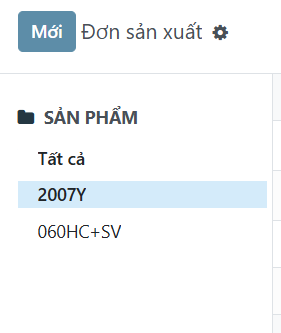
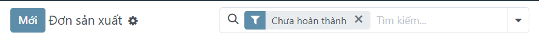
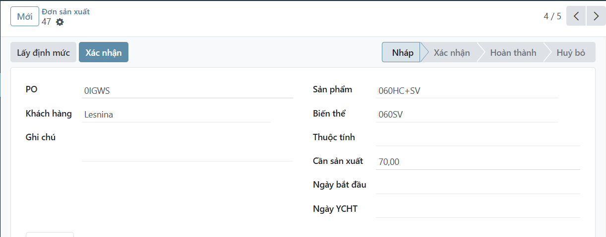
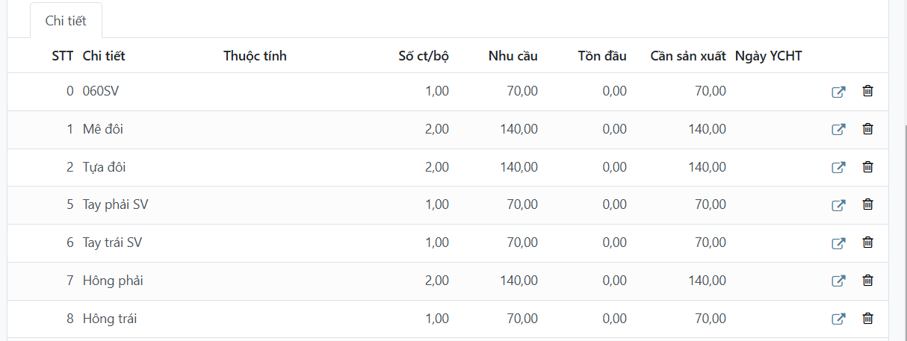

# Đơn sản xuất
*Menu:* Sản xuất -> Nhập liệu -> Đơn sản xuất

## Tìm kiếm 1 đơn
1. Lọc theo sản phẩm
    Chọn 1 sản phẩm panel trái
    
2. Hiện tất cả các đơn

    Mặc định chỉ hiện các đơn chưa hoàn thành

    Để hiện tất các đơn, nhấn nút bỏ lọc `Chưa hoàn thành`
    

## Tạo đơn mới
1. Nhấn nút `Mới`
2. Điền các thông tin
    

    *Lưu ý*: Nếu chưa có sản phẩm thì báo người quản lý để tạo sản phẩm và định mức

3. Nhấn nút `Lấy định mức`

    *Kết quả*: Tự động lấy các chi tiết và tính số lượng cần sản xuất

    

4. Sửa số lượng **Tồn đầu** (nếu cần)

## Xác nhận đơn
1. Nhấn nút `Xác nhận`
    
    **Trạng thái** sẽ chuyển từ `Nháp` sang `Xác nhận`

    **Ngày bắt đầu** được ghi nhận.
    
    *Lưu ý:* 

    - Đơn nào bắt đầu trước thì đc phân bổ trước

    - Đơn `Nháp` hoặc `Hoàn thành` bị ẩn lúc tạo phiếu thống kê, xem thêm phần [Phiếu thống kê](labor-hed-admin.md)

## Đóng đơn
1. Nhấn nút `Hoàn thành`

    **Trạng thái** sẽ chuyển sang `Hoàn thành`.

    Đơn ko còn hiện trong danh sách đơn hiện tại