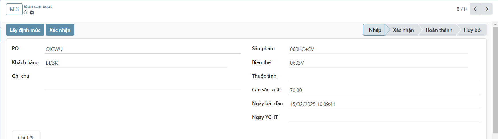

# Đơn sản xuất
## Menu
    Sản xuất -> Nhập liệu -> Đơn sản xuất

## Tạo đơn mới
1. Nhấn nút `Mới`
2. Điền các thông tin

3. Nhấn nút `Lấy định mức`

    *Kết quả*: Tự động lấy các chi tiết và tính số lượng cần sản xuất

    *Lưu ý*: Nếu hiện `Chưa có BoM` thì báo người quản lý BoM để tạo

4. Sửa số lượng tồn đầu (nếu cần)

## Tìm kiếm 1 đơn
1. Lọc theo sản phẩm
2. Hiện tất cả các đơn

    Mặc định chỉ hiện các đơn chưa hoàn thành

    Để hiện tất các đơn, nhấn nút bỏ lọc `Chưa hoàn thành`

## Xác nhận đơn
1. Nhấn nút `Xác nhận`
    
    **Trạng thái** sẽ chuyển từ `Nháp` sang `Xác nhận`

    **Ngày bắt đầu** được ghi nhận.
    (Đơn nào bắt đầu trước thì đc phân bổ trước, xem thêm phần [Phiếu thống kê](labor-hed.md))

## Đóng đơn
1. Nhấn nút `Hoàn thành`

    **Trạng thái** sẽ chuyển sang `Hoàn thành`.

    Đơn ko còn hiện trong danh sách đơn hiện tại

    Đơn ko còn hiện lúc thêm số lượng phiếu thống kê, [xem thêm](labor-hed.md)
